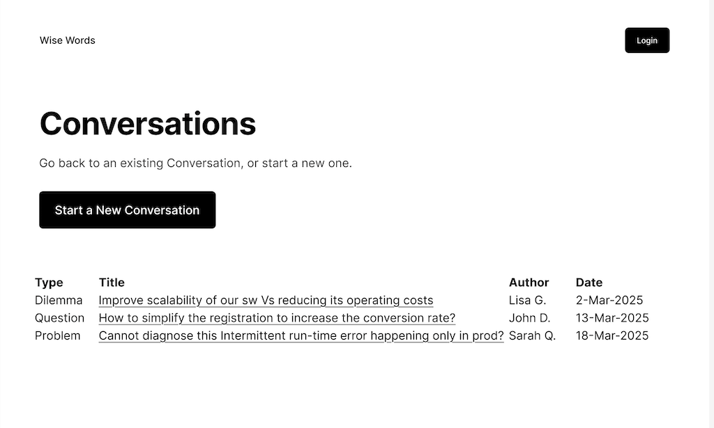
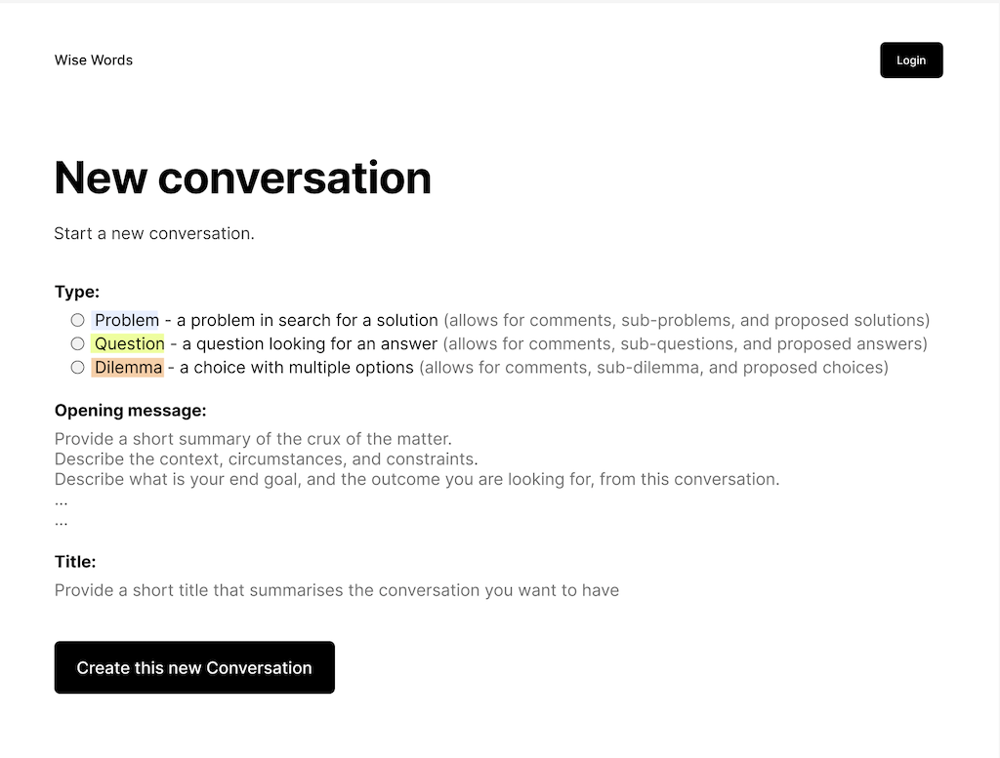
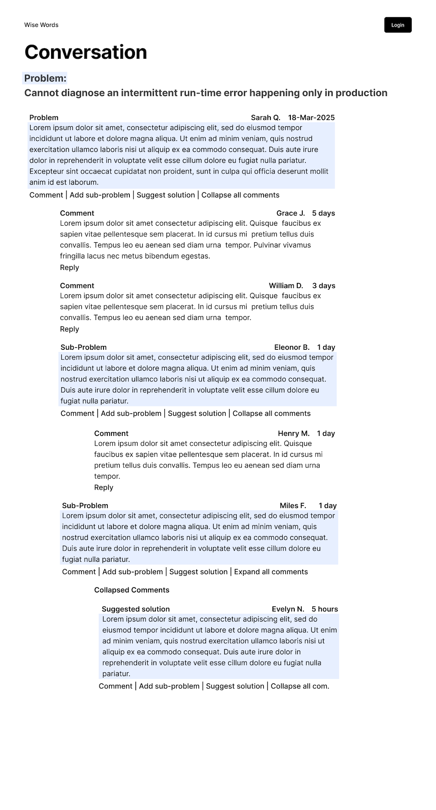

# Wise Words Beta: Production-Ready Implementation

After the Spikes, I've consolidates all the key components into this **Beta**. 

 All this while continuing with the experimentation of **AI-Assisted** coding.

## Architecture details

#### Beta: From Spikes to Production-Ready 

These are the projects I have completed in the Beta so far:
1. **WiseWords.ConversationsAndPosts.DataStore** - Real DynamoDB implementation
2. **WiseWords.ConversationsAndPosts.DataStore.Tests** - Comprehensive data layer testing
3. **WiseWords.ConversationsAndPosts.AWS.Lambdas** - Production Lambda functions
4. **WiseWords.ConversationsAndPosts.AWS.Lambdas.ApiGateway** - API Gateway integration
5. **WiseWords.ConversationsAndPosts.AWS.Lambdas.ApiGateway.Tests** - HTTP API testing

#### Key Improvements made in the Beta

- I have made several *rename* refactoring, improving the clarity of the code in all the projects.
- I have improved the error handling and messages in all the projects, including HTTP status codes returned.
- I have also enhanced the logging and extended it also to the Api Gateway layer.
- I have added End-to-end API testing via the  Api Gateway HTTP interface.
- I have introduced test/production configuration files to prepare for the move to the cloud.
- I have fixed minor inconsistencies in the types returned by their Lambda functions.
- I have improved input validation.
- I have fixed the mixed RESTful and RPC style APIs by adopting a RESTful style consistently, used the proper HTTP method, returned the specific status code for each situation, returned the correct body and enhanced the headers returned.

Several of these improvements were required over the code partially generated by the LLMs and AI-native/AI-enhanced IDEs employed.


#### Other minor improvements left, to be considered for later
- the use of the ConvoType.Enum numeric values used in some places and the use of string values for the same (QUESTION, PROBLEM, DILEMMA) could be harmonised, and strings could be used everywhere

### HTTP API Endpoints available to the CSR UI (RESTful API)

These are the endpoints I have implemented: 

- **`GET /conversations?updatedAtYear={year}&filterByAuthor={author}`** - Retrieve all existing conversations by year with optional author filtering
- **`POST /conversations`** - Create a new conversation (Problem, Question, or Dilemma)
- **`POST /conversations/drilldown`** - Add a drill-down post (sub-problem, sub-question, or sub-dilemma)
- **`POST /conversations/comment`** - Add a comment post in flat threading structure
- **`POST /conversations/conclusion`** - Add a conclusion post (solution, answer, or choice)
- **`GET /conversations/{conversationId}/posts`** - Get all posts of a specific conversation
- **`OPTIONS /conversations`** - CORS preflight support for web clients
- **`DELETE /conversations/{conversationId}`** - Delete an entire conversation and all its posts (administrative operation)

These are examples of  bash curl commands for exercising some of those endpoints
```bash
# Create a new Conversation
curl -i -X POST http://localhost:3000/conversations \
  -H "Content-Type: application/json" \
  -d '{"NewGuid":"81b481e0-c1fe-42fb-bc53-9d289aa05e84", "ConvoType":1, "Title":"Hello Title", "MessageBody":"Message body Hi", "Author":"MikeG", "UtcCreationTime":"2025-07-03T12:00:00Z"}'

# Append a DrillDown Post
curl -i -X POST http://localhost:3000/conversations/drilldown \
  -H "Content-Type: application/json" \
  -d  '{ "NewDrillDownGuid": "389de26e-d625-4ede-9988-73dc2841f8c2", "ConversationPK": "CONVO#81b481e0-c1fe-42fb-bc53-9d289aa05e84", "ParentPostSK": "", "Author": "HttpTestUser",  "MessageBody": "This is a drill-down post", "UtcCreationTime": "2025-07-09T10:39:03Z"}'

# Append a Comment Post
curl -i -X POST http://localhost:3000/conversations/comment \
  -H "Content-Type: application/json" \
  -d  '{"NewCommentGuid": "b869a64e-0953-41f3-b375-f100b6cfed28", "ConversationPK": "CONVO#81b481e0-c1fe-42fb-bc53-9d289aa05e84", "ParentPostSK": "", "Author": "HttpTestUser",      
"MessageBody": "This is a comment post",  "UtcCreationTime": "2025-07-09T10:44:32Z"}'

# Append a Conclusion Post
curl -i -X POST http://localhost:3000/conversations/conclusion \
  -H "Content-Type: application/json" \
  -d '{"NewConclusionGuid": "3f92293c-8877-4767-b373-030c98e6c3f1", "ConversationPK": "CONVO#81b481e0-c1fe-42fb-bc53-9d289aa05e84", "ParentPostSK": "", "Author": "HttpTestUser", "MessageBody": "This is a conclusion post", "UtcCreationTime": "2025-07-09T10:48:23Z"}'
    
#Retrieve Conversation's Posts
curl -i -X GET http://localhost:3000/conversations/CONVO%2381b481e0-c1fe-42fb-bc53-9d289aa05e84/posts 

# Retrieve Conversations by Year
curl -i -X GET "http://localhost:3000/conversations?updatedAtYear=2025"

#Delete a whole Conversation
curl -i -X DELETE http://localhost:3000/conversations/CONVO%2381b481e0-c1fe-42fb-bc53-9d289aa05e84
```

## TODO: Work completed and work left to be implemented

These and the steps that remain to be carried out: 
- ~~the implementation of the User Interface~~
- ~~Complete the UI implementation with the posting of messages on a conversation thread and minimising re-loads~~  
- Gradually deploy the appliation on AWS:
  - ~~added simple environment configuration settings for dev, CI/CD, AWS production environment,~~ 
  - deploy the db to the serverless Amazon DynamoDb, 
  - deploy of the serverless Lambdas 
  - deploy Api Gateway infrastructure
  - deploy the front-end to S3 
- Implement users authentication with Amazon Cognito, including registratation and login 
- Verify the current logging works and its integration with Amazon CloudWatch monitoring and observability
- Finalise automatic deploy, CI/CD.

## Original UI Mockups, now implemented in the current UI

#### Page: Conversations list + Start new conversation button

This page shows a list of conversations, each with a link to the individual conversation, and it also includes a button to start a new conversation.



#### Page: Start a new conversation

A click from the previous Conversations list page leads to the data entry for creating a brand new conversation.



#### Page: Conversation thread
A click on a specific conversation from the Conversations list page leads here, where the whole conversation thread is visible and it is possible to interact with it, posting comments, etc.


