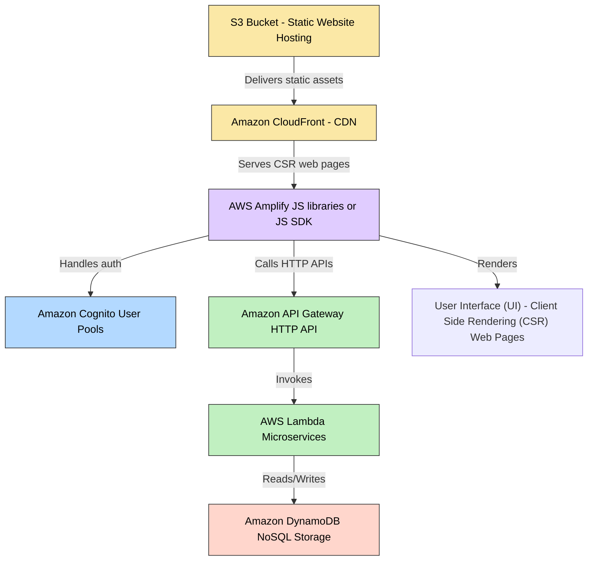
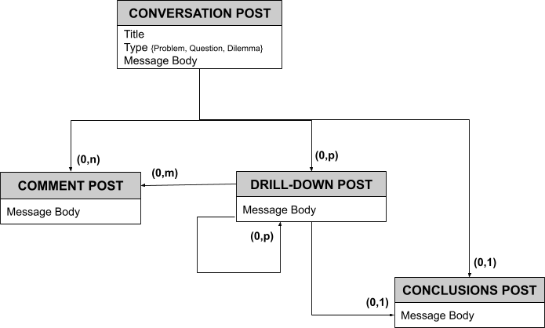

# Wise Words: a forum for conversations that find a destination

Wise Words is a side-project where I'm experimenting with **AI-assisted coding** (several LLMs and AI-native/AI-enhanced IDEs) -  it is far too early to commit to only one tool and only one LLM), while refreshing my skills in **cloud-native development** (AWS), including Serverless development (AWS Lambdas), **containers** (Docker, Kubernetes), **NoSQL** (DynamoDB), automated testing, DevOps and CI/CD.

In short, *Wise Words* is a basic forum for finding answers to difficult questions, exploring solutions to intractable problems, and discussing dilemmas to find suitable options collaboratively.

**Wise Words** encourages having **one collaborative conversation at a time** by supporting simple linear comments - as opposed to nested comments that equate to multiple overlapping conversations and talking over each other.
As the conversation unfolds, and the common understanding of the matter at hand grows, the forum allows consolidating the newfound understanding into **sub-questions, sub-problems, sub-dilemmas, and proposed conclusions** from which the conversation can proceed toward its destination. 

- Here are the spikes: follow the [(link)](Spikes/readme.md) for the related details
- Here is the Beta of *Wise Words*, still under development: follow the link [(link)](relative/path/to/readme.md) for the related details

## Technical design

The general principle I'm using for the design of *Wise Words* is to start **simple**, without precluding any options for future developments.

This design employs a **serverless architecture** that comes with a pay-per-use model (initial cost efficiency and no operational overhead) with the benefit of out-of-the-box high-availability and scalability if needed.
From the integration with this Cloud ecosystem also comes the possibility to use out-of-the-box Serverless Authentication and User Management, as infrastructure as code (IaC) services, and automated deployments, which I plan to use.

#### Sizing
In the current design and implementation, I am making the initial assumption of having to support a very low to medium volume of traffic, for example: 
- a thousand users 
- a few hundred conversations 
- hundreds of posts per conversation 
- a few hundred posts per day 
With the possibility of quickly and simply evolving the design to support increased traffic volume.

#### System design:

#### Single-table data design:

At this stage, in the NoSQL DynamoDB design and code, I have decided not to verify the referential integrity, which instead will be ensured:
- by not implementing physical deletion of conversations and posts (logical deletion may be implemented in the near future), and 
- by the client code, allowing posts to be added only to existing conversations.
This will speed up the DB operations while also avoiding the additional pay-per-use cost of the transactional operations.

## Local Development Environment

I have started the development of this side project in the local development environment, while experimenting with **AI-assisted coding** as mentioned before. And I am approaching the development gradually, one simple block at a time, with help from:
- AWS DynamoDB local development instance on Docker
- AWS Lambda .NET Mock Lambda Test Tool, to develop and test locally Lambda functions
- AWS SAM (Serverless Application Model) for local development and testing of AWS API Gateway routing and Lambda events
