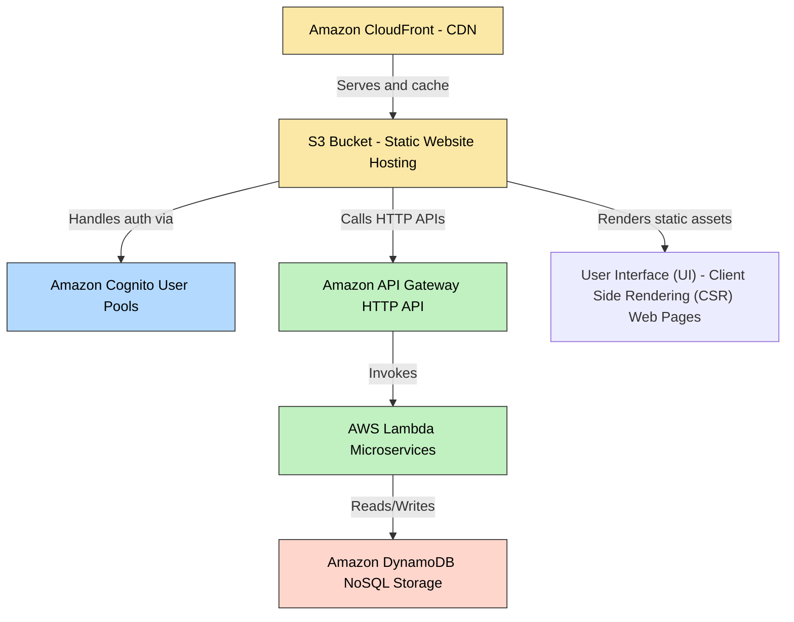
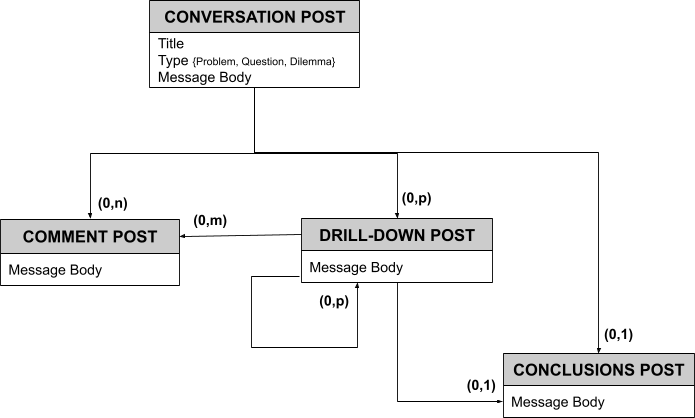

# Wise Words: a forum for conversations that find a destination

Wise Words is a side-project where I'm experimenting with **AI-assisted coding** (several LLMs and AI-native/AI-enhanced IDEs -  it is far too early to commit to only one tool and only one LLM), while refreshing my skills in **cloud-native development** (AWS), including Serverless development (AWS Lambdas), **containers** (Docker, Kubernetes), **NoSQL** (DynamoDB), automated testing, DevOps and CI/CD.

In short, *Wise Words* is a basic forum designed for finding answers to difficult questions, exploring solutions to intractable problems, and discussing dilemmas to find suitable options collaboratively.

**Wise Words** encourages having **one collaborative conversation at a time** by supporting simple linear comments - as opposed to nested comments that equate to multiple overlapping conversations and talking over each other.
As the conversation unfolds, and the common understanding of the matter at hand grows, the forum allows consolidating the newfound understanding into **sub-questions, sub-problems, sub-dilemmas, and proposed conclusions** from which the conversation can proceed toward its destination. 

## A quick account of this Beta implementation work so far

### The type of work done with the help of several LLMs AKA AI-assistants AKA genies

This project intent is to realise a well-defined product idea while refreshing my tech skills in coding, design, and architecture with a modern tech stack.

This is a greenfield project, low-risk (no business revenue or existing clients impacted) and potentially medium/high-reward (from the learning, and from potential interest in the practical applications of this beta).

For all these reasons, I used the AI-assistants exercising a  **high level of control** of the features produced, the **What**, and a **high level of attention** in the review of the code and the solutions produced by the LLMs, the **How**. Therefore, in this project, I have adopted a Chat-Oriented Programming (ChOP) approach that emphasises high control over features, **the What**, and diligent review of code quality, **the How**.

I have invested about a month of part-time, flexible schedule work to explore the latest technologies with some Spikes/POC.
I have invested a similar amount of time in implementing this beta. Half of this implementation time was dedicated to putting to test the new learning and to refreshing some skills. So under normal circumstances, this beta implementation time with LLMs would have taken approximately two weeks. This is more or less the size of the effort.

After exploring the various tech/system-design/architecture options, possibilities and trade-offs with the help of the LLMs, the available documentation and training, I personally made all the final decisions in relation to the 
- production infrastructure and system architecture (AWS)
- the tech-stack
- the design of the system and the data
- the architecture and high-level design of the code

with these overarching goals:
- minimising the cost of running it in production
- starting with a simple solution
- while preserving the possibility of easily evolving and scaling the solutions as needed.

On the backend (the NoSQL data store and related code, the lambdas and the API gateway code), the LLMs created about 70% of the code, and I contributed the remaining  30% of the code ensuring a high standard of quality and maintainability.

On the frontend (React, TypeScript, CSS), the LLMs created about 95% of the code and tests, and I created about 5% of the code and tests. Several prompts directed low-level details of the implementation, leaving the final responsibility of writing and changing the code to the LLMs. For the configuration scripts of AWS, DynamoDB, and the local dev environment, the code written by the LLM was even closer to 100%.

To bring the current Beta up to the level of an enterprise application, only a few minor changes are needed:
- strengthening some aspects of the security configuration, with a more fine-grained control
- adding more run-time error management with retries for key operations
- making some additional configuration and some code to enable the elastic scalability of the serverless architecture.
- replacing in the FrontEnd some defensive programming code produced by the LLMs with some less forgiving error handling
- with high-volume traffic and more features added to the application, asynchronous queues should be introduced 

## What I’ve learned so far coding with an AI-agent AKA genie
This beta is a greenfield project, potentially low-risk and high-reward, that demanded a high level of control over the features and a diligent review of internal quality. In this context:
- I've documented my key learnings from this; the link is coming soon
-  I've shared some of the commands and context I used to guide the AI, which you can see here: [MyAI-AgentCustomRules.md](./Beta/MyAI-AgentCustomRules.md)

When considering what worked well, it's essential to remember that all of this is context-specific. The value comes from asking follow-up questions like:
- have you tried something similar and what were your results? 
- what insights can we gain by comparing the similarities and differences in our contexts?
- what else is working (or not working) for you?

These questions can be applied to various scenarios that may differ from this beta, like for a: 
- Throw away prototype, or for
- Long living and/or legacy product codebase maintenance and evolution.

## The Beta live. Try it!
- [https://doxsj8lfqq7dm.cloudfront.net/](https://doxsj8lfqq7dm.cloudfront.net/)

## The latest Beta key info
- Here is key info on the implementation and its progress of *Wise Words*: follow the link [(link)](Beta/Readme.md) 

## Initial Specs: the anatomy of a Wise Words conversation

Here are the main conversation elements:
- **Conversation**: Conversation post is the root of a conversation tree
- **Comment**: Comment posts form a list of posts in a flat threading structure.
- **Drill-Down**: Drill-Down posts are organised in a nested threading structure.
- **Conclusion**: a Conclusion post is like a Drill-Down post, but it cannot be followed by any other post.

A **Conversation** root post can be followed by a flat list of Comment posts, a few nested Drill-Down posts, and a Conclusion Post. A **Drill Down** post can be followed by a flat list of Comment posts, a Conclusion post and a few nested Drill-Down posts.

A **Conversation** post can be one of these types:
- *Problem*: a problem in search of a solution
- *Question*: a question looking for an answer
- *Dilemma*: a choice among multiple available options

In the user's language,
- For a *Problem* type of Conversation 
  - a Drill-Down post is called *Sub-problem*
  - a Conclusion post is called *Proposed solution*
- For a *Question* type of Conversation
  - a Drill-Down post is called *Sub-question*
  - a Conclusion post is called *Proposed answer*
- For a *Dilemma* type of Conversation
  - a Drill-Down post is called *Sub-dilemma*
  - a Conclusion post is called *Proposed choice*

## Technical design

The general principle I'm using for the design of *Wise Words* is to start **simple**, without precluding any options for future developments.

This design employs a **serverless architecture** that comes with a pay-per-use model (initial cost efficiency and no operational overhead) with the benefit of out-of-the-box high-availability and scalability if needed.
From the integration with this Cloud ecosystem also comes the possibility to use out-of-the-box Serverless Authentication and User Management, as infrastructure as code (IaC) services, and automated deployments, which I plan to use.

#### Sizing
In the current design and implementation, I am making the initial assumption of having to support a very low to medium volume of traffic, for example: 
- a thousand users 
- a few hundred conversations 
- hundreds of posts per conversation 
- a few hundred posts per day 
With the possibility of quickly and simply evolving the design to support increased traffic volume.

#### System design:

```mermaid
%% Final Styled Serverless Architecture Diagram

graph TD
    %% Class Definitions first
    classDef frontend fill:#fbe8a6,stroke:#333,stroke-width:1px,color:#000000;
    classDef auth fill:#b3d9ff,stroke:#333,stroke-width:1px,color:#000000;
    classDef api fill:#c1f0c1,stroke:#333,stroke-width:1px,color:#000000;
    classDef db fill:#ffd6cc,stroke:#333,stroke-width:1px,color:#000000;
    classDef sdk fill:#e0ccff,stroke:#333,stroke-width:1px,color:#000000;

    %% Nodes (square brackets) with simplified labels (no parentheses)
    S3[S3 Bucket - Static Website Hosting]
    CloudFront[Amazon CloudFront - CDN]
    Cognito[Amazon Cognito User Pools]
    APIGateway[Amazon API Gateway HTTP API]
    Lambda[AWS Lambda Microservices]
    DynamoDB[Amazon DynamoDB NoSQL Storage]
    UI["User Interface (UI) - Client Side Rendering (CSR) Web Pages"]
    

    %% Connections with labels
    CloudFront -->|Serves and cache| S3
    S3 -->|Handles auth via| Cognito
    S3 -->|Calls HTTP APIs| APIGateway
    S3 -->|Renders static assets| UI
    APIGateway -->|Invokes| Lambda
    Lambda -->|Reads/Writes| DynamoDB

    %% Assign classes to nodes
    class CloudFront frontend;
    class S3 frontend;
    class Cognito auth;
    class APIGateway api;
    class Lambda api;
    class DynamoDB db;
    class frontend2 sdk;
```

#### Single-table data design:

At this stage, in the NoSQL DynamoDB design and code, I have decided not to verify the referential integrity, which instead will be ensured:
- by not implementing physical deletion of conversations and posts (logical deletion may be implemented in the near future), and 
- by the client code, allowing posts to be added only to existing conversations.
This will speed up the DB operations while also avoiding the additional pay-per-use cost of the transactional operations.

## Local Development Environment

I have started the development of this side project in the local development environment, while experimenting with **AI-assisted coding** as mentioned before. And I am approaching the development gradually, one simple block at a time, with help from:
- AWS DynamoDB local development instance on Docker
- AWS Lambda .NET Mock Lambda Test Tool, to develop and test locally Lambda functions
- AWS SAM (Serverless Application Model) for local development and testing of AWS API Gateway routing and Lambda events

## Other online tools used

- [GUID Generator](https://guidgenerator.app/)
- [Epoch & Unix Timestamp Conversion Tools](https://www.epochconverter.com/)
- [JSON validator and formatter](https://jsonlint.com/)

## The Spikes (Experiments and POC with the main components of the tech-stack)
- Here are the spikes, now completed: follow the [(link)](Spikes/Readme.md) for the related details
